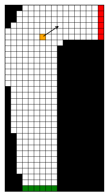

# 🏎️ Temporal Difference Learning for Racetrack Problem

## Overview

<figure width="20%" style="float: right;">
  
  <figcaption align="center">Fig.1 - Example of Racetrack</figcaption>
</figure>

This repository contains the code for the final project of A.Y. 2022-2023 [Professor Antonio Celani](https://www.ictp.it/member/antonio-celani#biography)'s course on **Reinforcement Learning** at ICTP (*International Centre for Theoretical Physics* at Trieste, Italy).

This repository contains a study on the application of **Temporal Difference learning methods** to solve the Racetrack problem as described in the book "Reinforcement Learning: An Introduction" by Richard S. Sutton and Andrew G. Barto. The Racetrack problem is a classic Reinforcement Learning problem where an agent must navigate a racecar around a racetrack as efficiently as possible.

The primary focus of this study is to implement and compare different TD learning algorithms, including SARSA, Q-Learning, and Expected SARSA. The goal is to analyze how these algorithms perform in this specific environment, their convergence, and the quality of the learned policies.

## Implemented Algorithms

This repository implements the following TD learning algorithms for solving the Racetrack problem:

1. **SARSA (State-Action-Reward-State-Action)**: A TD control algorithm that estimates the Q-values for each state-action pair and learns a policy that chooses actions based on these estimates.

2. **Q-Learning**: Another TD control algorithm that estimates Q-values, but it learns an optimal policy by always choosing the action with the maximum Q-value in a given state.

3. **Expected SARSA**: A variant of SARSA that calculates the expected value of the next Q-value, taking into account the probability of taking different actions.

## License

This project is licensed under the MIT License - see the [LICENSE](LICENSE) file for details.
